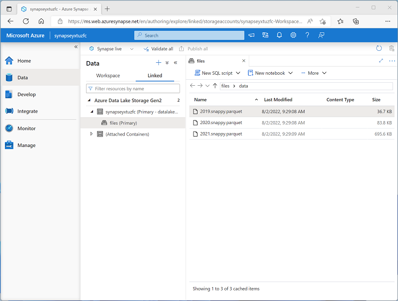
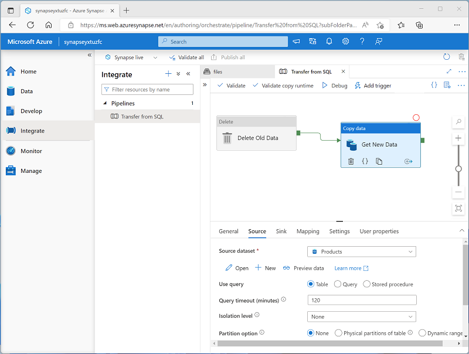

# Get Started with data engineering on Azure
https://learn.microsoft.com/en-us/training/paths/get-started-data-engineering/

### Exam DP-203: Data Engineering on Microsoft Azure
- https://learn.microsoft.com/en-us/certifications/exams/dp-203/
- pass exam to earn MCSA: Azure Data Engineer
  - https://learn.microsoft.com/en-us/certifications/azure-data-engineer/
  

# Azure for the Data Engineer
[Azure for the Data Engineer](https://docs.microsoft.com/en-us/learn/paths/azure-for-the-data-engineer/)

Data abundance
- increase in software and devices that generate data
- increase in human consumers of data and how they view it
- structured and unstructured

On-prem vs cloud data
- on prem
	- physical PC cost, OS licensing, hardware software firmware maintenance
	- scale by adding more nodes and clustering with load balancing
		- in clustering, each server in the cluster must be identical
	- availability / uptime
		- 3 nines, 4 nines or 5 nines
		- multiply by hours in year (8760) to see hourly up/down time
	- on-prem multilingual support is expensive
		- sort order requires reconfig, only an option if DBAs designed system to support multilingual
	- TCO (total cost of ownership) for on-prem includes
		- hardware
		- software
		- labor
		- datacenter overhead (power, telecom, cooling, etc)
	- if demand increases, need to immediately purchase new equipment
		- cost often capitalized (spread out across expected server lifespan) so hard to argue for more earlier
- cloud
	- charged as monthly sub, so no capitalizing across server lifespan
	- scalability by compute units, defined differently per Azure product
		- cost more closely matches usage
	- economies of scale bring lower costs
	- development environments are cheaper than prod
	- **lift and shift** strategy moves from on-prem to cloud without rearchitecting the app
		- quick and easy
		- but doesn't take advantage of all Azure features
	- unstructured data schema is typically defined at query time
		
Understand job responsibilities
- focus shifts away from SQL Server and toward general data, as a data engineer
- data engineers work with unstructured and variety of data, as well as relational data
- may need to learn new tools and languages
- ETL
	- transformation can take a long time
	- ties up resources
	- traditionally moves data from on-prem to on-prem
- ELT
	- data immediately extracted and loaded
	- more flexibility for multiple transformations for different uses
	- typically used for data from on-prem to cloud
- shift focus away from server implementation
	- simpler deployments if you want
	
Use cases for the cloud
- support web apps with quick response times anywhere in the world
- easily collab with data scientists using R, Scala, Python, etc.
- some Azure products designed specifically for IoT

# Intro to Azure Azure Data Lake Storage Gen2
Azure Data Lake Storage Gen2 is a comprehensive cloud storage data lake solution.

https://learn.microsoft.com/en-us/training/modules/introduction-to-azure-data-lake-storage/1-introduction

- **data lake** contains unstructured data in its natural format
	- stored in files, not relational db
- store in data lake, then consume with big data tech (like Apache Spark)
- Azure Data Lake stores in Hadoop-friendly format
- data replication (disaster recovery) borrows from Azure Blob storage
- Azure Storage Explorer organizes similar to directory-and-file structure
- Azure Data Lake is a configurable option of Azure Storage V2. It's not really its own product

Azure Blob Storage uses flat namespace for non-analysis storage. Azure Data Lake uses hierarchical namespace, which is pre-organized and allows for faster analysis.

1. **Ingest** Identify data sources and find the best way to ingest them (stream, batch)
	Stream ingestion: Apache Kafka for HDInsight, Stream Analytics
	Batch ingestion: Azure Synapse Analytics, Azure Data Factory
1. **Store** Identify where data should be placed
1. **Prep & Train** Data preparation, plus model training and scoring for ML
	Azure Synapse Analytics, Azure Databricks, Azure HDInsight, Azure Machine Learning
1. **Model & Serve** Present the data to users (Power BI)

## Use Azure Data Lake Storage Gen2 in data analytics workloads

### Big data 

3 Vs of "big data"
- massive VOLUME
- VARIETY of formats
- fast VELOCITY

Big data services 
- Azure Synapse Analytics
- Azure Databricks
- Azure HDInsight

Data processing frameworks
- Apache Spark
- Hive
- Hadoop

- distributed processing and storage enables parallel processing

### Data warehousing
- large volumes of unstructured files in data lake
- relational tables in data warehouse

**data lakehouse** uses external tables to define relational metadata layer over files in data lake

- Azure Synapse Analytics hosts ETL pipelines

### Real-time data analytics

- Azure Event Hub
  - queues streaming data from IoT devices
- Azure Stream Analytics
  - hosts jobs to query and aggregate event data as it arrives
  - results go in an output **sink**

### Data science and Machine Learning (ML)

- Apache Spark
- Python
- Azure Machine Learning
  - run Python code in notebooks
  - dynamically allocated distributed compute resources

# Intro to Azure Synapse Analytics
https://learn.microsoft.com/en-us/training/modules/introduction-azure-synapse-analytics/

## What is Azure Synapse Analytics

4 common analytical techniques
1. Descriptive
2. Diagnostic
3. Predictive
4. Prescriptive

## How Azure Synapse Analytics works

- centralized service for data storage and processing
  - plus linked services for commonly-used
    - data stores
    - processing platforms
    - visualization tools

**workspace** an instance of Synapse Analytics service

- manual creation via Azure portal
- automated instantiation via...
  - PowerShell 
  - Azure CLI
  - Azure Resource Manager
  - Bicep template

**Synapse Studio** web-based portal for Synapse Analytics

## Working with files in a data lake

## Ingesting and transforming data with pipelines

**pipelines** used to ETL/ELT
- based on same underlying tech as Azure Data Factory

continue at https://learn.microsoft.com/en-us/training/modules/introduction-azure-synapse-analytics/3-how-works

